<div align="center">

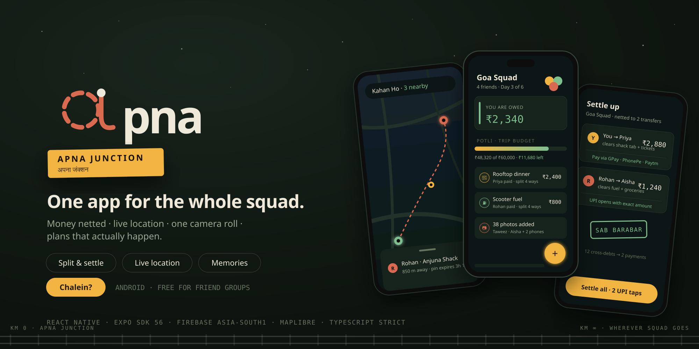

<br />
<br />


<br />
<br />

**One app for the whole squad — money, memories, maps, and moments, permanently connected.**

<br />

[](https://play.google.com/store)
[](https://expo.dev)
[](https://reactnative.dev)
[](https://firebase.google.com)
[](https://typescriptlang.org)

<br />

> WhatsApp has the chat. Splitwise has the money. Google Photos has the memories.
> Nobody stitched them together for a friend group. **apna does.**

<br />

<table border="0">
  <tr>
    <td align="center">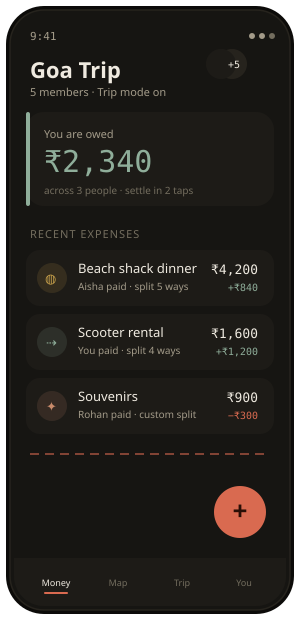<br /><sub><b>Group balance</b></sub></td>
    <td align="center">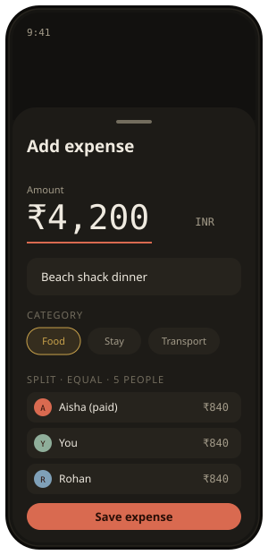<br /><sub><b>Add expense</b></sub></td>
    <td align="center">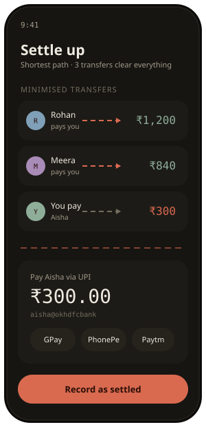<br /><sub><b>Settle up (UPI)</b></sub></td>
    <td align="center">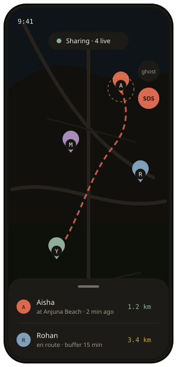<br /><sub><b>Live map</b></sub></td>
  </tr>
</table>

<sub>Screens rendered in the <b>Ink</b> theme. Mockups, not marketing — they mirror the shipped Kora &amp; Ink components.</sub>

<br />

</div>

---

## Contents

- [What apna is](#what-apna-is)
- [The problem](#the-problem)
- [Screens](#screens)
- [Features](#features)
- [How settlement works](#how-settlement-works)
- [Kora and Ink — the design system](#kora-and-ink--the-design-system)
- [Architecture](#architecture)
- [Real-time data flow](#real-time-data-flow)
- [Data model](#data-model)
- [Tech stack](#tech-stack)
- [Security and privacy](#security-and-privacy)
- [Getting started](#getting-started)
- [Environment](#environment)
- [Running the app](#running-the-app)
- [Project structure](#project-structure)
- [Cloud Functions](#cloud-functions)
- [Testing](#testing)
- [Build and release](#build-and-release)
- [Roadmap](#roadmap)
- [Contributing](#contributing)
- [License](#license)

---

## What apna is

**apna** is the group-life app built from scratch for Indian friend groups — the squad that travels together, splits bills daily, shares moments, and asks *"kahan hai tu?"* more than any other question.

It is not a trip planner. It is not an expense tracker. It is not a photo album. It is all three, permanently connected, with live location on top — designed for the way Indian friend groups actually live.

The core insight: your squad already runs on WhatsApp, Splitwise, Google Maps, and a shared album. They switch between five apps on every trip. apna replaces all five with one that carries the context every other app throws away. The ₹840 dinner links to the rooftop photo from that night. The itinerary stop shows up as a pin on the map. The settlement clears with one UPI tap.

---

## The problem

A typical friend group on a trip juggles five disconnected apps:

| App | Used for | The pain |
| --- | --- | --- |
| WhatsApp | Coordination, "who paid for lunch?" | Context buried in thousands of messages |
| Splitwise | Expense tracking | Cold and transactional — no memories attached |
| Google Maps | Navigation | No friend layer — location still shared over chat |
| Google Photos | Shared album | Disconnected from the trip and the spend |
| Notes | Itinerary | Private, never updated, never shared |

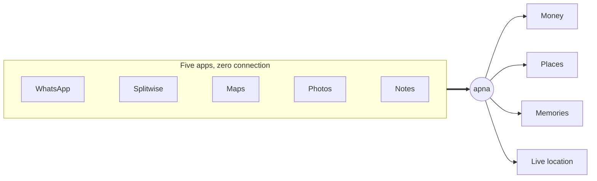

### How apna compares

| | WhatsApp | Splitwise | Google Maps | Google Photos | **apna** |
| --- | :---: | :---: | :---: | :---: | :---: |
| Split bills | — | Yes | — | — | **Yes** |
| Shortest-path settle | — | Partial | — | — | **Yes** |
| UPI one-tap pay | — | — | — | — | **Yes** |
| Live friend location | Manual | — | — | — | **Yes** |
| Shared trip album | — | — | — | Yes | **Yes** |
| Itinerary + voting | — | — | Saved lists | — | **Yes** |
| Everything, one context | — | — | — | — | **Yes** |

---

## Screens

<table border="0">
  <tr>
    <td width="33%" align="center"></td>
    <td width="33%" align="center"></td>
    <td width="33%" align="center"></td>
  </tr>
  <tr>
    <td align="center"><sub><b>Group balance</b><br />Owed / owes at a glance</sub></td>
    <td align="center"><sub><b>Add expense</b><br />Five split types</sub></td>
    <td align="center"><sub><b>Settle up</b><br />Fewest transfers, UPI pay</sub></td>
  </tr>
  <tr>
    <td width="33%" align="center"></td>
    <td width="33%" align="center">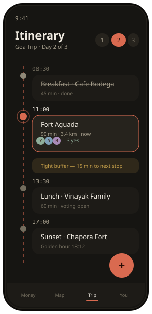</td>
    <td width="33%" align="center">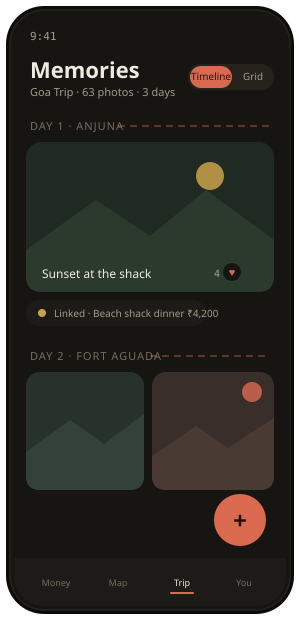</td>
  </tr>
  <tr>
    <td align="center"><sub><b>Live map</b><br />Pins, route, ghost, SOS</sub></td>
    <td align="center"><sub><b>Itinerary</b><br />Day plan, votes, buffer warnings</sub></td>
    <td align="center"><sub><b>Memories</b><br />Timeline linked to spend</sub></td>
  </tr>
</table>

> A wide [social-preview banner](docs/screens/social-preview.svg) (1280×640) ships in `docs/screens/`. GitHub's share-card slot accepts PNG/JPG only, so export first:
>
> ```bash
> npm i -D sharp        # one-time, on demand
> npm run export:screens   # writes PNGs to docs/screens/png/ at 2x
> ```
>
> Then upload `docs/screens/png/social-preview.png` under **Settings → General → Social preview**. The same command also produces PNGs of every screen for app-store listings and decks.

---

## Features

### Money and settlement

- **Every split type** — equal, equal-subset, custom amounts, percentage, and by-item line-by-line restaurant bills.
- **Shortest-path settlement** — the balance engine minimises the number of transactions mathematically. N expenses across a group collapse to the fewest possible transfers.
- **Multi-currency** — INR default, with USD, EUR, AED, THB. The exchange rate is locked at entry time and never retroactively recalculated.
- **Receipt photos** — attach a bill to any expense, compressed to 2 MB, member-only access.
- **UPI deep links** — Settle Up opens GPay / PhonePe / Paytm with the amount pre-filled. One tap to actually pay.
- **Export** — formatted PDF report or raw CSV, with category breakdown and per-person summary.

### Live location

- **Off by default.** Every share is an explicit opt-in session.
- Friend pins on a custom map, updated every 15 seconds over Firebase Realtime Database.
- **Ghost mode** — see others while hiding yourself.
- **SOS** — a one-time high-priority location broadcast that works even when sharing is off, and is never stored.
- Every location auto-expires after four hours.

### Memories, itinerary, and trip wrap

- Shared photo timeline, grid, and map view — each memory can carry a caption, a place, and a trip day.
- Day-by-day itinerary with venue search, voting, and buffer-time warnings.
- **Trip Wrap** — a Cloud Function aggregates trip stats and top memories into a recap when the trip ends.

### Group life

- Activity feed and push notifications for every meaningful event.
- QR and 6-character invite codes.
- Privacy-preserving contact sync (hashes only — see below).
- Android home-screen widgets for balance and map, built natively with Jetpack Compose Glance.

---

## How settlement works

The engine turns a tangle of "who paid what" into the **fewest possible transfers**. First it nets every expense into one balance per person; then it greedily matches the largest creditor to the largest debtor until everyone is at zero.

Take four friends in Goa:

| Expense | Paid by | Amount | Split |
| --- | --- | --- | --- |
| Beach shack dinner | Aisha | ₹4,200 | equal / 4 |
| Scooter rental | You | ₹1,600 | equal / 4 |
| Souvenirs | Rohan | ₹900 | equal / 4 |

Netting each person against their fair share of ₹1,675 gives:

```
Aisha  +2,525      Rohan  -775
You     -75        Meera  -1,675
```

A naive approach settles debt-by-debt (up to 6 transfers). apna reduces it to **3**:

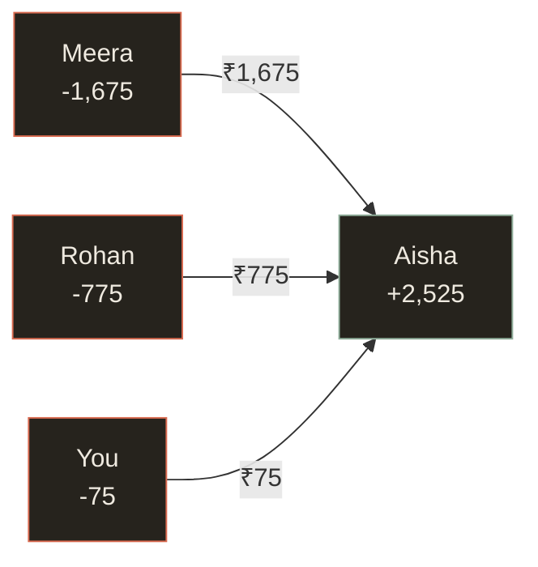

For *n* people the result is at most *n − 1* transfers, always. The engine is pure and deterministic, lives in [`src/lib/budget`](src/lib/budget), and is covered to 100% by [`src/tests/settlement.test.ts`](src/tests/settlement.test.ts).

---

## Kora and Ink — the design system

The system is named for two states of the same cloth: **Ink** (dark) and **Kora**, unbleached cotton (light). Both are the same design at different times of day. One dyed accent — *madder* — carries all meaning; everything else is warm neutral. The running-stitch motif (a dashed thread) recurs from the logo to the active tab indicator.

<table border="0">
  <tr>
    <td align="center"><br /><sub><b>Ink</b> — the default, evening</sub></td>
    <td align="center">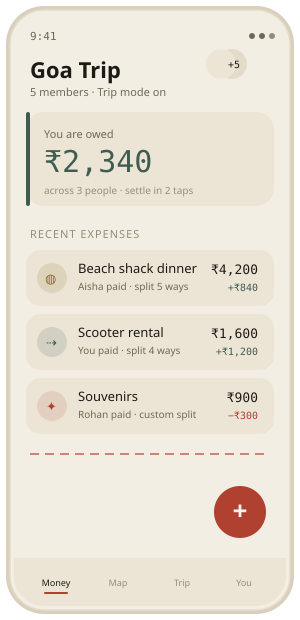<br /><sub><b>Kora</b> — daylight, unbleached cotton</sub></td>
  </tr>
</table>

The same screen, the same tokens — only the fabric changes.

### Palette

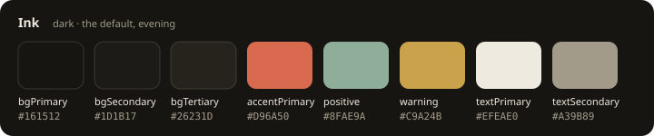

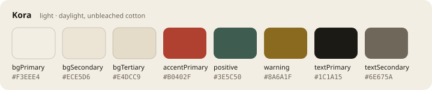

| Token | Role | Ink | Kora |
| --- | --- | --- | --- |
| `bgPrimary` | Main surface — the cloth | `#161512` | `#F3EEE4` |
| `bgSecondary` | Grouped rows, tab bar | `#1D1B17` | `#ECE5D6` |
| `bgTertiary` | Inputs, sheets, chips | `#26231D` | `#E4DCC9` |
| `accentPrimary` | Madder — the dyed thread | `#D96A50` | `#B0402F` |
| `positive` | Leaf — owed to you, settled | `#8FAE9A` | `#3E5C50` |
| `warning` | Haldi — budget nearing | `#C9A24B` | `#8A6A1F` |
| `textPrimary` | Primary text | `#EFEAE0` | `#1C1A15` |
| `textSecondary` | Labels, metadata | `#A39B89` | `#6E675A` |

### Type and motion

| Role | Typeface | Notes |
| --- | --- | --- |
| Display / heading | Cabinet Grotesk (Bold, Extrabold) | The wordmark and section titles |
| Body / label | General Sans (Regular, Medium) | Everything read at length |
| Numerals | Spline Sans Mono (Medium) | Every amount, invite code, and timestamp — precise, financial |

Colour encodes meaning only; decoration is done with neutrals. Amounts are always monospaced so money never looks decorative.

---

## Architecture

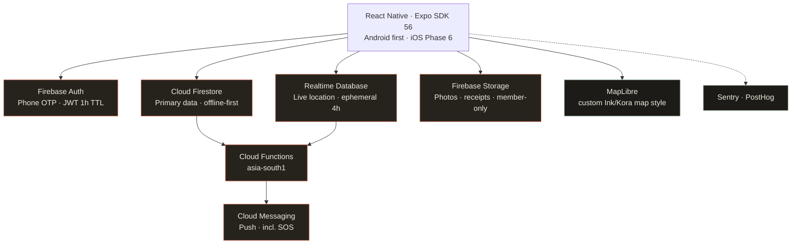

Every Firebase service runs in **asia-south1 (Mumbai)** — never us-central1. State is Zustand persisted to MMKV; Firestore offline persistence means reads come from cache and writes are queued while offline.

---

## Real-time data flow

**Adding an expense** — the client writes once; the server does the maths.

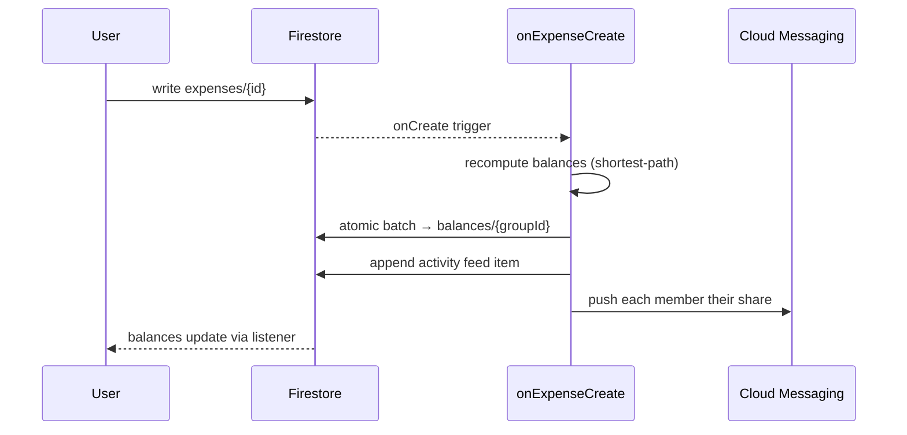

**Sharing location** — ephemeral, listener-driven, self-deleting.

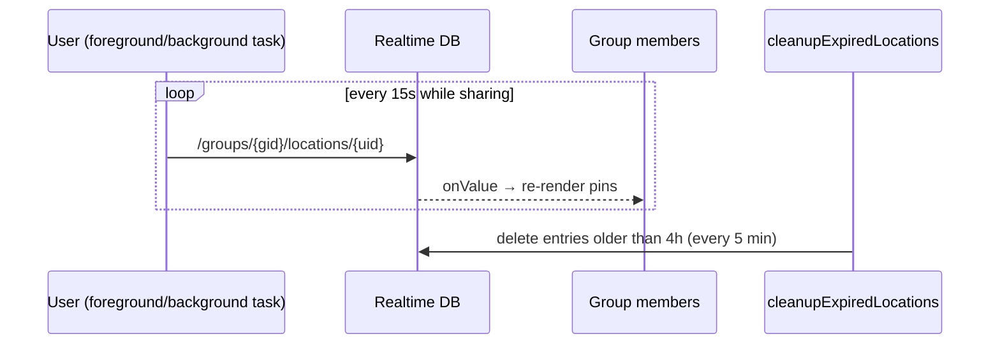

---

## Data model

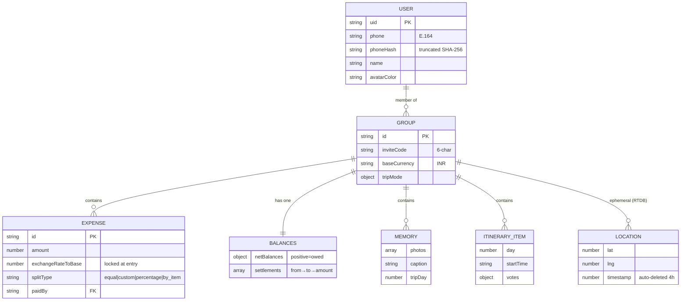

Full TypeScript interfaces live in [`src/lib/types/`](src/lib/types) (one `*.types.ts` per domain), with Firestore collection refs and converters in [`src/lib/firebase/`](src/lib/firebase).

---

## Tech stack

| Layer | Choice | Why |
| --- | --- | --- |
| Framework | React Native 0.85 + Expo SDK 56 | Fastest path to production-quality native Android |
| Language | TypeScript, strict mode | Zero `any` — every type explicit |
| State | Zustand + MMKV | Lightweight, no boilerplate, ~10× faster than AsyncStorage |
| Navigation | React Navigation v7 | Deep-link support, native stack |
| Data | Cloud Firestore | Offline-first primary store |
| Live location | Realtime Database | WebSocket, low latency, ephemeral |
| Maps | MapLibre (`@maplibre/maplibre-react-native`) | Open, self-styled Ink/Kora map |
| Backend | Cloud Functions (asia-south1) | Settlement engine, notifications, cron |
| Validation | Zod | Runtime schema safety at boundaries |
| Observability | Sentry + PostHog | Crash tracking and product analytics |

Native modules of note: `expo-camera`, `expo-haptics`, `expo-task-manager` (background location, 4-hour auto-expire), `expo-contacts`, `expo-crypto` (contact hashing), and a custom Expo config plugin for Jetpack Compose Glance widgets.

---

## Security and privacy

- **Phone OTP only** — no passwords to steal, no email to phish. JWTs expire hourly with silent refresh; logout revokes tokens across all devices.
- **Server-authoritative balances** — the activity feed and balances collections are write-blocked client-side (`allow write: if false`) and only ever written by Cloud Functions.
- **No cross-group reads** — the core Firestore rule is that no user can read data from a group they are not a member of.
- **Location is ephemeral** — it lives only in Realtime DB, never Firestore, and is auto-deleted after four hours. SOS shares are never stored.
- **Contact matching is hashed** — phone numbers are SHA-256 hashed on-device; only truncated hashes reach the server, and results come back masked (`+91XXXXX12345`). Raw numbers never leave the phone.
- **Photos are member-only** — no public read on any Storage path; external shares use signed URLs with 24-hour expiry.
- **Account deletion** removes the user from every group map, deletes their photos and profile, revokes FCM tokens, and clears on-device MMKV — while preserving expense records (marked "Deleted User") for balance integrity.

Rules are versioned in [`firestore.rules`](firestore.rules), [`storage.rules`](storage.rules), and [`database.rules.json`](database.rules.json), and covered by tests (`npm run test:rules`).

---

## Getting started

### Prerequisites

```
Node.js         >= 18
npm             >= 9
Java JDK        >= 17          # Gradle build
Android Studio  or a USB-debug Android device
Firebase CLI    npm i -g firebase-tools
```

### Install

```bash
git clone <repo-url>
cd apna
npm install
cp .env.example .env          # then fill in the values below
```

---

## Environment

Create `.env` in the project root — it is git-ignored, never commit it.

```env
# Firebase
EXPO_PUBLIC_FIREBASE_API_KEY=
EXPO_PUBLIC_FIREBASE_AUTH_DOMAIN=
EXPO_PUBLIC_FIREBASE_PROJECT_ID=
EXPO_PUBLIC_FIREBASE_STORAGE_BUCKET=
EXPO_PUBLIC_FIREBASE_MESSAGING_SENDER_ID=
EXPO_PUBLIC_FIREBASE_APP_ID=
EXPO_PUBLIC_FIREBASE_DATABASE_URL=

# Maps, weather, analytics, crash
EXPO_PUBLIC_MAP_STYLE_URL=
EXPO_PUBLIC_OPENWEATHER_API_KEY=
EXPO_PUBLIC_POSTHOG_KEY=
EXPO_PUBLIC_POSTHOG_HOST=
EXPO_PUBLIC_SENTRY_DSN=

EXPO_PUBLIC_ENV=development
```

> On the Android emulator, Firebase emulators are reached at `10.0.2.2`, not `localhost`. The app handles this automatically in development.

### Firebase emulators

```bash
firebase login
firebase emulators:start
# Auth 9099 · Firestore 8080 · Storage 9199 · Functions 5001 · RTDB 9000
```

---

## Running the app

```bash
# First run — compiles native code (~10 min)
npx expo run:android

# Subsequent runs — hot reload
npx expo start --android

# Type check — must be zero errors (strict, no `any`)
npm run typecheck
```

On a physical device: enable Developer Options (tap Build Number seven times), turn on USB debugging, connect, then run `npx expo run:android`.

---

## Project structure

```
apna/
├─ src/
│  ├─ components/        UI primitives + budget / camera / location / members
│  ├─ screens/          auth · budget · groups · itinerary · map · memories · profile
│  ├─ navigation/       RootNavigator (auth gate) · MainNavigator (tabs) · deeplink
│  ├─ lib/
│  │  ├─ firebase/      config · auth · firestore · storage · location
│  │  ├─ budget/        settlement engine · calculators · currency
│  │  ├─ contacts/      reader · hasher · matcher
│  │  ├─ location/      background task · permissions · session timer
│  │  └─ notifications/ rules · batching · FCM tokens
│  ├─ hooks/            useBackgroundLocation · usePhotoUpload · useWidgetSync · …
│  ├─ stores/           Zustand stores, MMKV-persisted
│  ├─ tasks/            backgroundLocation.task.ts (root import)
│  ├─ theme/            Kora & Ink — colors · typography · spacing · motion
│  └─ tests/            settlement · budget · contacts · notifications · …
├─ functions/src/       triggers · callable · scheduled (asia-south1)
├─ plugins/             withApnaWidgets.ts — Android Glance config plugin
├─ android/             expo prebuild output (incl. widget Kotlin)
├─ docs/                DESIGN_BLUEPRINT · DESIGN_PRD · accessibility-audit
├─ firestore.rules · storage.rules · database.rules.json · firestore.indexes.json
└─ app.config.ts
```

---

## Cloud Functions

All deployed to **asia-south1**, all authenticated, all typed.

| Function | Trigger | Responsibility |
| --- | --- | --- |
| `onExpenseCreate` | Firestore onCreate | Recompute balances, activity item, push each member their share |
| `onExpenseDelete` / `onExpenseUpdate` | Firestore | Recompute balances on change |
| `onMemberJoin` / `onMemberLeave` | Firestore onUpdate | Activity item, balance adjustment, welcome push |
| `onSOSTriggered` | HTTPS callable | High-priority push with maps deep link |
| `generateTripWrap` | HTTPS callable | Aggregate trip stats and top memories into a recap |
| `matchContactsByHash` | HTTPS callable | Match hashed contacts, return masked profiles |
| `cleanupExpiredLocations` | Scheduled, 5 min | Delete RTDB location older than 4 hours |
| `sendItineraryReminders` | Scheduled, hourly | "One hour away" reminders |
| `sendOnThisDay` | Scheduled, 08:00 IST | Trip-anniversary notifications |

---

## Testing

```bash
npm test                 # all unit + integration tests
npm run test:coverage    # with coverage
npm run test:rules       # Firestore security-rules suite
npm run typecheck        # tsc --noEmit
npm run lint:design      # Kora & Ink token linter
```

Coverage targets: settlement engine and phone/contact hashing at 100%; budget calculators, session timer, and notification rules at 90%+.

---

## Build and release

```bash
npm i -g eas-cli && eas login

# Production Android App Bundle for the Play Store
eas build --platform android --profile production
eas submit --platform android

# Ship a JS-only fix without a full rebuild
eas update --branch production --message "fix: settlement rounding"
```

Build profiles are defined in [`eas.json`](eas.json) — `development` (dev client), `preview` (internal APK), and `production` (AAB).

---

## Roadmap

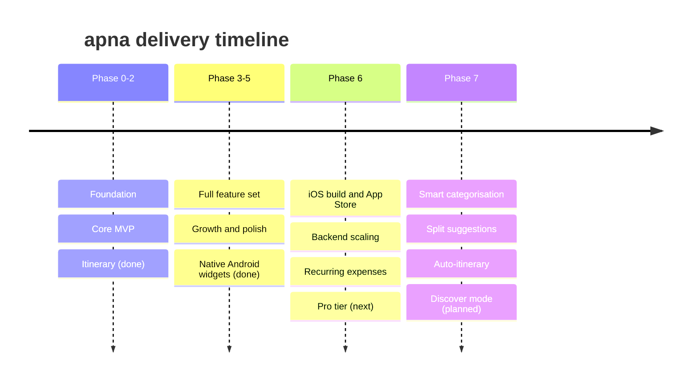

**North-star metric — Weekly Active Groups:** groups with at least one expense, memory, or location share in the last seven days. It is the only number that says whether apna is actually part of people's lives.

---

## Contributing

apna is a private product under active development. If you have repository access, every commit must pass:

```bash
npm run typecheck        # zero errors
npm run lint:design      # zero warnings
npm test                 # zero failures
```

Non-negotiables:

- **MMKV only** — AsyncStorage is banned.
- **Firebase JS SDK modular** — the compat SDK is banned.
- **asia-south1** for every Firebase service — never us-central1.
- **TypeScript strict** — no `any`, anywhere.
- **`[lng, lat]` order** for MapLibre — never `[lat, lng]`. This is the single most common bug.

Commit style: `feat:`, `fix:`, `chore:`, `test:` — imperative and scoped, for example `fix: settlement rounding for ₹1 split among 3 people`.

---

## License

**Proprietary — all rights reserved.** Copyright © 2026 apna. This software and its source code are the exclusive property of the apna team; unauthorised copying, distribution, or use, in whole or in part, is prohibited. See [`LICENSE`](LICENSE).

<div align="center">

<br />


<br />

*yeh sirf ek app nahi hai. yeh apna hai.*

Built in India, for India.

</div>
