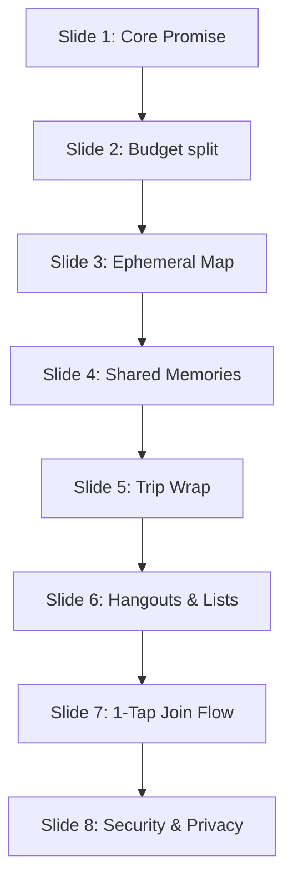

# apna — Play Store Assets Suite

This document defines the complete storefront metadata, copy systems, graphic guidelines, and QA criteria for the **apna** Play Store listing on Android. It turns the core product story into a conversion-oriented storefront that communicates credibility, premium dark-first brand aesthetics, and immediate squad utility for Indian Gen Z and millennial friend groups.

---

## 1. Screenshot Narrative Sequence (6–8 Slides)

The screenshot sequence moves from emotional hook and squad pain points to practical value, concluding with a trust-building screen. All screens utilize the **Dhaga** design system aesthetics: custom dark-mode templates (`#080C14` background), Outfit headings, JetBrains Mono numbers, and the connecting neon-thread visual metaphor.



### Slide 1: The Core Promise (The Hook)
*   **Visual Composition**: High-fidelity mockup of the **Group Hub** screen showing a squad feed. In the center, a vibrant thread (teal gradient) loops around different card elements (expenses, location check-ins, memories).
*   **Visual Accents**: Avatars of a real friend group stacked at the top-right. Bold countdown banner: *"Jaipur Trip in 3 Days"*.
*   **Device Frame**: Premium borderless phone frame floating over a dark gradient background.

### Slide 2: Budget & Finance (The Social Payoff)
*   **Visual Composition**: The **Budget Dashboard** screen showing a net balance summary.
*   **Visual Accents**: A bold hero number: `+₹1,875` in Outfit font, colored in vibrant teal (`#4ECDC4`). Below it, a clean settlement card: *"Arjun owes Sneha ₹1,875"* with a sleek, rounded **"Settle via UPI"** button.
*   **Context Details**: The feed shows recent entries like *"Pranav added ₹840 for LMB Lunch · Split Equal"* with a tiny receipt thumbnail attached.

### Slide 3: Live Map & Location (Safety & Coordination)
*   **Visual Composition**: Custom Mapbox dark style map viewport.
*   **Visual Accents**: Clean circular avatar pins scattered along a route:
    *   *Sneha* (Teal ring: live) with label *"LMB Sweet Shop · Just reached"*
    *   *Pranav* (Dimmed ring: 2 min ago) with label *"12 min away (In traffic)"*
*   **Key CTA**: Temporary location sharing toggle is shown as active, with a visible countdown timer: *"Sharing expires in 2h 14m"*. A prominent **SOS** button glows subtly in the top right.

### Slide 4: Shared Memories (Emotional Archive)
*   **Visual Composition**: A gorgeous masonry photo grid showing the **Memories Feed**.
*   **Visual Accents**: Large, high-resolution photographs of a real Indian friend group (climbing Amer Fort, drinking Kulhad Chai). A day tag header: *"Day 1 · Jaipur"*.
*   **Micro-Interactions**: Visual floating emoji reactions (`❤️ x 5`, `🔥 x 8`) clustered at the bottom edge of the photos.

### Slide 5: Trip Wrap (The Keepsake)
*   **Visual Composition**: The **Trip Wrap Summary Card**—styled like a premium retro festival ticket or concert pass.
*   **Visual Accents**: A summary card showing:
    *   *"Total Squad Spend: ₹52,500"*
    *   *"Memories Captured: 142"*
    *   *"Top Spot: Amber Fort"*
*   **CTA Overlay**: A share icon with the tag *"Share Recap to Instagram / WhatsApp"*.

### Slide 6: Hangouts & Packing Lists (Daily Utility)
*   **Visual Composition**: Split screen showing the **Hangout Planner** and a **Shared Checklist**.
*   **Visual Accents**:
    *   Top card: *"Friday Chai & Kulfi Run? · 5 RSVP Yes"*
    *   Bottom card: Packing List items like *"Arjun is bringing the Bluetooth Speaker"* with Arjun's profile avatar pinned next to the claimed item.

### Slide 7: Zero-Friction Join Flow (Low Barrier)
*   **Visual Composition**: The ticket-style **QR Code Invite Screen**.
*   **Visual Accents**: A large, clean QR code framed by a neon border. Above it, the invite code: `APNA·26` in large mono letters. Underneath, a dynamic stack of friend avatars with the notification: *"Riya is joining the group..."*

### Slide 8: Privacy & Trust (Reassurance)
*   **Visual Composition**: Simple, high-contrast privacy control center mockup.
*   **Visual Accents**: Large security indicators showing:
    *   *No background tracking (Open app only)*
    *   *No ads, ever*
    *   *OTP-only secure login*
*   **Brand Lockup**: Lowercase **apna** logo centered at the bottom.

---

## 2. Screenshot Copy System

The copy is conversational, punchy, and speaks directly to the experiences of Indian Gen Z and millennials without using corporate jargon.

| Slide | Focus | Headline (Outfit Bold) | Subcopy (Outfit Medium) |
| :--- | :--- | :--- | :--- |
| **1** | Core Promise | WhatsApp is for chat. apna is for your squad. | Ditch the app shuffle. Connect your budget, location, and memories on one single thread. |
| **2** | Budget split | No more *"Bhai, tune kitna diya?"* | Track shared expenses, calculate exact settlements, and pay instantly via UPI. Zero awkward talks. |
| **3** | Ephemeral Map | *"Kahan hai tu?"* solved forever. | Share your live location with the group on a secure map. Set ETAs and check in automatically. |
| **4** | Memories | One album for the group's best moments. | Stop chasing friends for photos. Save geotagged memories on a shared timeline everyone can access. |
| **5** | Trip Wrap | Relive the trip, even after it ends. | Get auto-generated recaps of your group spending, top spots, and shared highlight reels. |
| **6** | Hangouts & Lists | From *"chalo plan banate hain"* to confirmed. | Coordinate weekend hangouts, vote on venues, and assign shared packing lists without the chaos. |
| **7** | Join Flow | One tap. Scan, join, and you're in. | No passwords. No signup friction. Just scan a ticket-style QR code or tap a link to join. |
| **8** | Trust & Security | Private by design. Safe by default. | Phone OTP login, default-off location sharing, and zero ad networks. Just you and your squad. |

---

## 3. Feature Graphic Concept

The feature graphic is the first visual element users see on mobile and desktop storefronts. It must command attention and instantly convey the core aesthetic.

```
+-----------------------------------------------------------------------------+
|  apna.                                    * [Polaroid Memory]               |
|  One thread for your squad.                 \ (Gold Glow)                   |
|                                              \                              |
|   (Outfit Display, 48px)                     (Teal Thread)                  |
|                                                \                            |
|                                      [Live Map Pin] --- [₹ Cash Token]      |
|                                      (Avatar 'P')     / (Mono font)         |
|                                                      /                      |
|                                       [Itinerary Stop]                      |
+-----------------------------------------------------------------------------+
```

*   **Dimensions**: 1024 x 500 px (Landscape PNG/JPEG).
*   **Color Palette**: Deep ocean background (`#080C14` with a radial gradient transitioning to `#06080E` at the corners) to anchor the dark-first brand mood.
*   **Visual Centerpiece**: A single, thin, high-contrast neon thread (**Dhaga**) glowing in a gradient of teal (`#4ECDC4`) and warm gold (`#FFD166`). The thread moves gracefully from the bottom-left toward the top-right.
*   **Interactive Nodes**: Linked along the thread are four sleek, card-like tokens representing the app's primitives:
    1.  **Money**: A small JetBrains Mono `₹` token in teal border.
    2.  **Location**: A circular Mapbox-style friend pin containing a profile avatar ('S' in coral).
    3.  **Memories**: A miniature, slightly rotated polaroid outline with a warm gold glow.
    4.  **Coordination**: A small checklist ticket symbol.
*   **Typography**: Left-aligned headline in **Outfit Bold**:
    *   **apna.** (48px, White `#F0F4FF`)
    *   **One thread for your squad.** (24px, Muted Grey-Blue `#8A94B0` on the next line).
*   **Crop Safety**: All typography and key graphic nodes are kept within a central 60% safe zone, ensuring readable presentation when cropped to square shapes on different device screens.

---

## 4. Store Icon Usage Guidance

To build strong brand equity, the store icon must remain uncluttered and instantly recognizable.

*   **Visual Treatment**:
    *   **Background**: Deep ocean solid block (`#080C14`).
    *   **Core Glyph**: A lowercase letter **`a`** stylized with a looping thread motif (**Dhaga**) that curves into the letter stem, finished in a high-fidelity teal-to-gold gradient (`#4ECDC4` to `#FFD166`).
*   **Legibility Constraints**:
    *   No promotional text tags (e.g., "FREE", "NEW", "No. 1") are permitted inside the icon.
    *   The glyph outlines are clean and high-contrast, ensuring it remains distinct when scaled down to 24dp on home screens or system trays.
*   **Play Store Specifications**:
    *   A 512 x 512 px PNG, max 1024KB.
    *   Full square shape (Google Play Console applies the round corner mask automatically).
    *   Supports Android adaptive launcher standards (separate foreground and background layers for dynamic animations).

---

## 5. Short Description

> **Ditch the app shuffle. Track group expenses, share live maps, and save memories.**
*(Exactly 75 characters — Play Store limit is 80 characters)*

---

## 6. Full Description

```text
Stop shuffling between group chats, expense trackers, maps, and shared photo albums. 

meet apna. One thread for your squad. Lowercase, simple, and built for the way Indian friend groups actually live. 

apna brings your group's budget, live location, shared memories, and hangout plans into a single, beautiful space. Whether you are planning a weekend trip to Lonavala, sharing rent with roommates, or meeting up for daily evening chai, apna keeps your squad on the same page.

Why friend groups love apna:

1. THE MONEY LAYER (Without the Awkwardness)
Asking friends for money is socially loaded. apna does the math and depersonalizes the request:
• Track expenses in seconds — split equally, by custom amounts, or item-by-item.
• Shortest-path settlements: apna calculates the minimum transactions needed so you aren’t sending multiple UPI transfers.
• Clear debt sheets: "The app says you owe, not me." Settle instantly via UPI deep links that open GPay, PhonePe, or Paytm with pre-filled amounts.

2. THE MAP LAYER (Live, Safe, & Ephemeral)
No more spamming the chat with "Kahan hai tu?" or waiting on location updates:
• On-demand location sharing: Turn on sharing temporarily when you are meeting up or traveling.
• Safe and default-off: You control when you are seen. Sharing auto-expires after 4 hours or when you arrive.
• Live ETAs: See who is stuck in traffic and who has already arrived at the spot.
• Emergency SOS: Press and hold for 2 seconds to alert the entire group with your live location.

3. THE MOMENTS LAYER (Shared, Contextual Memories)
Stop chasing friends on WhatsApp to "send photos in document format":
• Shared memory timeline: Post photos and short videos directly to a chronological feed.
• Geotagged & dated: Photos are auto-grouped by day and pinned to your group map.
• High-quality archives: Download full-resolution photos to your camera roll anytime.
• React and relive: Drop quick reactions (❤️, 😂, 🔥) and get anniversary alerts on your phone.

4. THE PLANS LAYER (From Hangouts to Day-Wise Trips)
Take the chaos out of planning:
• RSVP Polls: Coordinate weekend plans. Set a minimum headcount, propose places, and get auto-confirmed events.
• Itinerary Planner: Day-by-day blocks with venue search, route overlays, and directions.
• Shared Lists: Packing checklists, task assignments, and grocery runs. Claim items so two people don't end up bringing the same speaker.
• Trip Wrap: When your trip ends, get an auto-generated recap showing your total squad spend, travel statistics, and a shareable memory reel.

Privacy-First, Squad-Only:
• Zero Friction Joins: No email, no passwords, no signup loops. Join a group instantly by scanning a ticket-style QR code or tapping a link.
• Absolute Privacy: Location sharing is ephemeral and off by default.
• No Spam, No Ads: apna is a premium space for you and your friends. We do not sell your data or serve annoying ads.

yeh sirf ek app nahi hai. yeh apna hai.

Install apna today and experience group life, simplified.
```

---

## 7. Keyword and Positioning Strategy

apna is positioned as a **Group Life OS** rather than a transactional utility. The organic search strategy targets functional queries while capturing emotional Hinglish search intent.

```
       [ Group Life OS ]
       /               \
[ daily utility ]     [ trip mode ]
  - rent split          - itineraries
  - chai run            - live maps
  - RSVP hangouts       - trip wraps
```

### Search Engine Optimization (SEO) Metadata
*   **Meta Title**: `apna: Group Expense Split, Live Map & Memories`
*   **Meta Description**: `Simplify group trips and daily life. Split bills with UPI, share live locations with ETAs, plan itineraries, and build shared photo albums in one secure app.`

### Core Keyword Clusters

#### 1. Group Expense Splitting (Direct Competitor Search)
*   *Keywords*: `splitwise alternative`, `group bill split`, `split expenses with friends`, `upi bill splitter`, `roommate expense tracker`.
*   *Listing Integration*: Focus on Hinglish-friendly pain points ("settling chai bills", "roommate rent split") alongside native UPI integrations.

#### 2. Friend Maps & Live Location (Social Discovery Search)
*   *Keywords*: `zenly alternative`, `find my friends map`, `live location tracker`, `friend locator gps`, `group trip map`.
*   *Listing Integration*: Emphasize the temporary, ephemeral nature of the location tracking ("default-off", "auto-expires in 4 hours") to address privacy concerns.

#### 3. Trip Planning & Shared Albums (Utility Search)
*   *Keywords*: `shared trip planner`, `group travel organizer`, `shared photo album timeline`, `itinerary maker with map`, `trip wrap recap`.
*   *Listing Integration*: Frame this as a collaborative board where planning, execution, and memory capture happen seamlessly on the same thread.

#### 4. Conversational / Hinglish Search Intent (High Conversion)
*   *Keywords*: `squad map tracker`, `tour budget split`, `whatsapp group planner app`, `bhai tune kitna diya`.
*   *Listing Integration*: Embed these terms in the long-form descriptions organically to capture natural conversational search patterns.

---

## 8. Asset QA Checklist

Before finalizing any Store Listing deployment on the Google Play Console, verify each asset against this checklist to ensure conversion optimization and brand alignment.

### Visual Design & Readability
*   [ ] **Micro-Scale Legibility**: Are the key texts (headings, transaction numbers) on the screenshots legible at 30% screen size on a mobile device?
*   [ ] **Safe Zones**: Are all texts, mockups, and icons placed at least 15% (or 60px) away from the asset edges to prevent crop cutoff on notched screens?
*   [ ] **Dark-First Mood**: Do all mockups reflect the dark-mode primary color (`#080C14`) and keep contrast levels high?
*   [ ] **Font Standards**: Are headings styled in *Outfit* and financial values in *JetBrains Mono* to preserve brand consistency?
*   [ ] **Consistent Avatars**: Do the avatars used in the mockups match the color palette and feel like a real friend group?

### Copy & Audience Alignment
*   [ ] **No Jargon**: Has all corporate speak (e.g., "collaborative paradigm", "financial synchronization") been removed in favor of direct, human terms?
*   [ ] **Hinglish Flow**: Do Hinglish terms (like *Bhai*, *squad*, *chai*) flow naturally and avoid sounding forced?
*   [ ] **Feature Accuracy**: Does the copy strictly promise features that are currently live or immediately shipping (no future AI auto-planning claims)?
*   [ ] **Value Ordering**: Do the first three screenshots show the highest-value pain killers (Splitting, Live Location, Shared Albums) instead of settings/onboarding?

### Store Policy & Technical Compliance
*   [ ] **Competitor Guidelines**: Does the copy avoid using trademarked names like "Splitwise", "WhatsApp", or "Google Maps" in comparison text (e.g., do not say "better than Splitwise")?
*   [ ] **Accreditation Limits**: Are there any unsanctioned badges (like "Best App of 2026") present on the screenshots or graphics?
*   [ ] **Icon Adaptability**: Is the store icon structured with transparent layers to support circular, square, and squircle system masks?
*   [ ] **Character Limits**: Is the Short Description verified to be exactly at or under 80 characters?
*   [ ] **Universal Link Support**: Are the deep link patterns presented in the descriptions compatible with the domain formats registered in `app.config.ts`?
